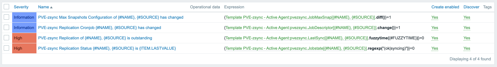

# Zabbix Template PVE-zsync

Template for monitoring replications jobs perfomaded by [PVE-zsync](https://pve.proxmox.com/wiki/PVE-zsync) in PVE. The project uses python 3 scripts and is tested on Zabbix Server 5.0 and Proxmox 6.2.

### Prerequisites

What things you need to run the scripts and how to install them using pip3. (Consulte the documentation of your system to install pip3 if you haven't)

```
apt install python3-pip
pip3 install python-crontab
pip3 install croniter
pip3 install cron-descriptor
```
### How to Use

1. Download the scripts to `/etc/zabbix/scripts`
2. Copy the User Parameter file to `/etc/zabbix/zabbix_agentd.d`
3. Restart Zabbix-Agent
4. Upload the template to Zabbix Server
5. Link the template to a host

### Screenshots




### Customization

* A custom tolerance for the fuzzytime, i.e. the time between each cron run, can be set for each host by overwriting the Macro {$FUZZYTOLERANCE} on the Macros page. The fuzzytime is used for the trigger "Replication x is outstanding" 

 
